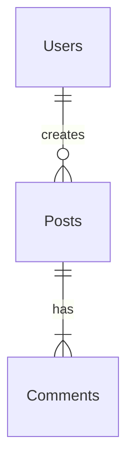

# Inventário de Database - [Nome do Projeto]

**Single Source of Truth** para o schema do banco de dados. Este documento guia a implementação e as migrações.

---

## 1. Convenções & Padrões
*   **Case**: `snake_case` para tabelas e colunas.
*   **Timestamps**: Todas as tabelas devem ter `created_at` e `updated_at` (automático via trigger).
*   **IDs**: `uuid` (v4) ou `bigint` (Identity) dependendo da escala. Padrão: `uuid`.
*   **Foreign Keys**: Nome explícito `[tabela_origem]_[coluna_id]`.

---

## 2. Diagrama ER (Mermaid)

---

## 3. Detalhamento das Tabelas

### [nome_tabela]
**Descrição**: [Propósito da tabela]
**Tipo**: [Core / Feature / Dictionary]

| Coluna | Tipo | Nullable | Default | PK/FK | Descrição/Restrições |
| :--- | :--- | :---: | :--- | :--- | :--- |
| `id` | `uuid` | ❌ | `gen_random_uuid()` | **PK** | Identificador único |
| `created_at` | `timestamptz` | ❌ | `now()` | - | Data de criação |
| `updated_at` | `timestamptz` | ❌ | `now()` | - | Data de atualização |
| `[coluna]` | `[tipo]` | [✅/❌] | - | [FK] | [Descrição e Checks] |

**Índices & Performance:**
*   [ ] `idx_[tabela]_[coluna]` (B-Tree): Otimiza queries de filtro por [coluna].
*   [ ] `idx_[tabela]_[fk]` (B-Tree): Otimiza joins com [tabela estrangeira].

**Políticas de Segurança (RLS Analysis):**
*   **Enable RLS**: [YES]
*   **Roles**: `anon`, `authenticated`, `service_role`
*   **Policies**:
    *   `SELECT`: [Quem pode ver? Ex: `auth.uid() == user_id`]
    *   `INSERT`: [Quem pode criar? Ex: `auth.uid() == user_id`]
    *   `UPDATE`: [Quem pode editar?]
    *   `DELETE`: [Quem pode deletar?]

---

## 4. Programmability (Functions, Triggers, Views)

### Triggers
*   **Nome**: `handle_updated_at`
*   **Tabela**: `ALL`
*   **Evento**: `BEFORE UPDATE`
*   **Ação**: Garante que `updated_at` seja atualizado automaticamente.

### Database Functions (RPC)
*   **Nome**: `[nome_funcao]`
*   **Args**: `[argumentos]`
*   **Retorno**: `[tipo]`
*   **Lógica**: [Descrição do que a função faz, ex: transação complexa]

---

## 5. Storage Buckets (File Object Storage)
*   **Bucket**: `[nome-bucket]`
*   **Public**: [Sim/Não]
*   **Policies**:
    *   `UI acess`: [Regra de visualização]
    *   `Upload`: [Regra de upload (tamanho, tipos)]

---

## 6. Dados Semente (Seed Data)
*   Enums/Tipos estáticos que precisam ser inseridos na inicialização.
*   [Lista de valores essenciais]

---

## 7. Migration Roadmap
*   **Fase 1 (MVP)**: Tabelas Core + Auth.
*   **Fase 2**: [Feature X] tables.
*   **Fase 3**: Otimizações de índice e Views analíticas.

---

*Última Revisão por Sofia: [Data]*
