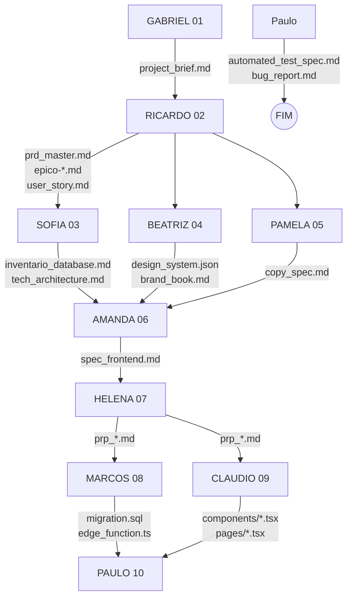

# Documentação Completa - Metodologia Vibe Code | StarIAup

## Etapas de desenvolvimento tradicional

Este fluxograma detalha um processo estruturado de planejamento de produtos de software, desde a ideia inicial até a prontidão para o desenvolvimento. Para facilitar a compreensão, dividi o processo em **cinco fases principais**:

### 1. Pesquisa e Descoberta (Opcional)

O processo começa com uma **Ideia de Projeto**. O primeiro passo é decidir se haverá uma fase de pesquisa conduzida por um **Analista**.

* **Se sim:** O Analista realiza um brainstorming, pesquisa de mercado e análise de concorrentes para criar um **Briefing do Projeto**.
* **Se não:** O fluxo segue diretamente para a definição do produto.

### 2. Definição do Produto (PRD)

Nesta etapa, o objetivo é transformar a ideia (ou o briefing) em um **PRD** (Documento de Requisitos do Produto). O caminho depende da disponibilidade de informações:

* **Com Briefing disponível (Fast Track):** O **PM (Product Manager)** cria o PRD rapidamente com base nos dados existentes, além de definir os Épicos e Histórias de Usuário.
* **Sem Briefing:** O PM realiza uma criação interativa, fazendo mais perguntas para extrair as necessidades.
* **Resultado:** Um PRD completo contendo Requisitos Funcionais (FRs), Não Funcionais (NFRs), Épicos e Histórias de Usuário com critérios de aceitação claros.

### 3. Design e Arquitetura Técnica

Com o PRD em mãos, o fluxo se divide conforme a necessidade de interface (UX) e fundação técnica:

* **Arquitetura (Fundação):** O **CTO/Arquiteta** define a estrutura de banco de dados (Inventário), stack tecnológico e regras de segurança (RLS). Ela é a fonte única de verdade técnica.
* **Branding e Copy:** O **Especialista de Marca** define a identidade visual (fontes, cores) e o **Copywriter** define o tom de voz.
* **Design (Interface):** O **UI/UX Designer** cria as especificações de tela e workflows de usuário, consumindo o Design System e o Inventário.

### 4. Estratégia de Testes e Validação

Antes de codar, garantimos qualidade na origem:

* **QA Planejado:** O **QA Engineer** analisa as User Stories e cria planos de testes automatizados e critérios de aceitação verificáveis.
* **Checklist do PO:** O **PO (Product Owner)** valida se o planejamento cobre todos os requisitos de negócio.

> [!IMPORTANT]
> **Ciclo de Ajuste:** Se o planejamento não estiver completo ou aprovado, o documento volta para ajuste (PM, CTO ou Designer) antes de prosseguir.

### 5. Execução (Vibe Coding)

Uma vez planejado, inicia-se a execução guiada por IA:

1. **Prompt Engineering:** O **Prompt Engineer** transforma requisitos em instruções cirúrgicas (PRPs) para a IA.
2. **Implementação:** Desenvolvedores Backend e Frontend executam o código seguindo estritamente a arquitetura e os PRPs.
3. **QA Automatizado:** O QA valida as entregas contra os critérios de aceitação usando testes automatizados.

---

## Como fazemos por aqui

Decidimos incrementar o que já funciona em um desenvolvimento tradicional, mas com a IA como principal motor. O conceito de "vibe coding", introduzido em 2024 e consolidado em 2025 é a base de todo o processo.

Porém vibe coding ainda é muito "cru". Consome-se milhares de tokens para executar e reexecutar ações, o que é muito custoso. Custo de tempo e dinheiro. Isso acontece porque a maioria das pessoas que usam vibe code, não fazem a menor ideia de como é o desenvolvimento de software.

Nós decidimos ir além. Sabemos do potencial da IA, e sabemos também que ela pode (e vai) cometer erros. Por isso, criamos um sistema que, se realmente aplicado, tende a minimizar os erros e potencialmente mitigar retrabalho. Otimizando o consumo de tokens e o tempo de desenvolvimento.

Com isso, conseguimos desenvolver landing pages, saas, sistemas até mesmo outros agentes para a crew.

### Nosso Crew de Especialistas

**Usuário - PO (Product Owner)**
- O dono da ideia, define prioridades e aprova entregas.
- O primeiro usuário do MVP, antes de ser entregue ao cliente final.
- Responsável por validar os artefatos gerados pelos agentes antes de passar para a próxima fase.

---

**Sofia - CTO (Chief Technology Officer) / Arquiteta**
- A autoridade técnica máxima. Define a stack, a arquitetura e a segurança.
- Cria o **Inventário de Database** (`inventario_database.md`), que é a "Fonte Única de Verdade" para qualquer dado.
- Garante que Backend e Frontend sigam a mesma estrutura e contratos.
- Valida se o código implementado corresponde à documentação (Documentation Sync).

---

**Ricardo - PM (Product Manager)**
- Estrategista do produto. Transforma visões abstratas em documentos concretos.
- Cria o **PRD Master**, define **Épicos** e escreve **User Stories** detalhadas.
- Garante que cada funcionalidade tenha um "porquê" de negócio claro.
- Alimenta a Helena (Prompt Engineer) com histórias estruturadas.

---

**Amanda - UI/UX Designer**
- Tradutora visual. Converte requisitos e identidade de marca em interfaces funcionais.
- Cria especificações de frontend (`spec_frontend.md`) e workflows de página.
- Utiliza o `design_system.json` da Beatriz para garantir consistência visual.
- Define a experiência do usuário (UX) antes de uma única linha de código ser escrita.

---

**Marcos - Backend Developer Sênior**
- O executor do "lado servidor". Especialista em segurança, performance e dados.
- Implementa as tabelas, RLS policies, migrations e Edge Functions definidas pela Sofia.
- **Subordinação Técnica:** Segue estritamente a arquitetura da Sofia.
- Obsessivo por segurança: "Nunca confie no cliente".

---

**Claudio - Programador Sênior Full-Stack**
- O integrador. Especialista em React, componentes e conexão com APIs.
- Implementa as interfaces desenhadas pela Amanda e conecta com o backend do Marcos.
- **Subordinação Técnica:** Segue a arquitetura de pastas da Sofia e o Design System.
- Focado em código limpo, componentização e tratamento de erros.

---

**Paulo - QA Auto Engineer**
- O "Advogado do Diabo" automatizado. Especialista em Browser Testing (Playwright).
- Valida se a implementação atende aos **Critérios de Aceite** das User Stories.
- Executa testes automatizados que simulam o comportamento do usuário real.
- Garante que "funciona na minha máquina" não seja uma desculpa aceitável.

---

**Helena - Engenheira de Prompt / Supervisora**
- A maestra da IA. Tradutora de requisitos humanos para instruções de máquina.
- Consome Épicos/Stories do Ricardo e Arquitetura da Sofia para criar **PRPs (Product Requirement Prompts)**.
- Garante que a IA (o modelo de execução) receba contexto suficiente para não alucinar.

---

**Gabriel - Orchestrator**
- O ponto de partida. Gerencia o início do projeto e a configuração do repositório.
- Realiza o briefing inicial e entende o contexto macro do usuário.
- Prepara o terreno para o Ricardo iniciar o trabalho de produto.

---

**Beatriz - Brand Identity Specialist**
- A guardiã da marca. Define a "alma" visual do projeto.
- Cria o **Brand Book** e o **`design_system.json`** (cores, tipografia, tokens).
- Garante que o produto não seja apenas funcional, mas tenha identidade.

---

**Pamela - Lead Copywriter**
- A voz do produto. Define como o sistema "fala" com o usuário.
- Cria o **`copy_spec.md`**, padronizando textos, mensagens de erro e microcopy.
- Trabalha com Amanda e Beatriz para garantir que texto e design conversem.

---

### Mapeamento de Responsabilidades por Etapa

GABRIEL (01) → project_brief.md
      │
      ▼
RICARDO (02) → prd_master.md, epico-*.md, user_story.md
      │
      ├──────────────────────┬─────────────────────────┐
      ▼                      ▼                         ▼
SOFIA (03)               BEATRIZ (04)              PAMELA (05)
inventario_database.md   design_system.json        copy_spec.md
tech_architecture.md     brand_book.md             
      │                      │
      ├──────────────────────┤
      ▼                      ▼
AMANDA (06) ← design_system.json + inventario_database.md
spec_frontend.md
      │
      ▼
HELENA (07) → prp_*.md
      │
      ├──────────────────────┐
      ▼                      ▼
MARCOS (08)              CLAUDIO (09)
migration.sql            *.tsx, *.ts
edge_function.ts         
      │                      │
      ├──────────────────────┤
      ▼                      ▼
PAULO (10) → automated_test_spec.md, bug_report.md

Para ficar ainda mais claro:
01 - Gabriel/      ← Orchestrator (PRIMEIRO)
02 - Ricardo/      ← PM
03 - Sofia/        ← CTO (paralelo Beatriz/Pamela)
04 - Beatriz/      ← Brand (paralelo Sofia/Pamela)
05 - Pamela/       ← Copywriter (paralelo Sofia/Beatriz)
06 - Amanda/       ← UI/UX
07 - Helena/       ← Prompt Engineer
08 - Marcos/       ← Backend
09 - Claudio/      ← Full-Stack
10 - Paulo/        ← QA Auto (ÚLTIMO)
knowledge/         ← Global

---

### Responsabilidades por Etapa

0. **Usuário (PO - Product Owner):**
   * **O que faz:** É o dono da ideia. Ele traz a ideia para o Gabriel validar e se validado, inicia-se a pesquisa, briefing e projeto em si. Aprova cada fase crítica (PRD, Arquitetura, Design) antes de avançar.

1. **Gabriel (Orchestrator):**
   * **O que faz:** Inicia o projeto. Coleta o briefing inicial, entende o objetivo macro, configura o repositório e estrutura as pastas iniciais. Passa o bastão para Ricardo.

2. **Ricardo (PM):**
   * **O que faz:** Define "O QUE" será feito. Cria o PRD Master, quebra o projeto em Épicos (`epico.md`) e detalha User Stories (`user_story.md`) com critérios de aceitação.

3. **Sofia (CTO):**
   * **O que faz:** Define "COMO" será feito tecnicamente. Cria a Arquitetura Técnica e o Inventário de Database (`inventario_database.md`). Define as regras de RLS e a estrutura de pastas que todos devem seguir.

4. **Beatriz (Brand):**
   * **O que faz:** Define a identidade visual base. Entrega o `design_system.json` e o Brand Book, estabelecendo as fundações estéticas para a Amanda.

5. **Pamela (Copy):**
   * **O que faz:** Define a voz e o texto estratégico. Entrega o `copy_spec.md` para guiar os textos das interfaces que a Amanda vai projetar.

6. **Amanda (UI/UX):**
   * **O que faz:** Define a interface e fluxos. Consome o Design System (Beatriz) e o Copy (Pamela) para criar especificações detalhadas de frontend (`spec_frontend.md`) e workflows de página.

7. **Helena (Prompt Engineer):**
   * **O que faz:** Prepara a execução. Pega as Stories (Ricardo) e a Arquitetura (Sofia) e cria os PRPs (Product Requirement Prompts), que são as instruções cirúrgicas para a geração de código.

8. **Marcos (Backend):**
   * **O que faz:** Executa o Backend. Implementa tabelas, migrations, edge functions e segurança seguindo estritamente as definições da Sofia e os PRPs da Helena.

9. **Claudio (Frontend):**
   * **O que faz:** Executa o Frontend. Cria componentes, páginas e integrações seguindo o design da Amanda, a arquitetura da Sofia e os PRPs da Helena.

10. **Paulo (QA Auto):**
   * **O que faz:** Valida a entrega. Executa testes automatizados de navegador para verificar se a implementação do Marcos e Claudio cumpre os critérios de aceitação definidos nas User Stories do Ricardo.

---

## **Glossário de Termos e Siglas**

### Papéis e Responsabilidades

* **PO (Product Owner):** O representante dos interesses do cliente. Decisor final.
* **PM (Product Manager):** Estrategista do produto. Define requisitos e roadmap.
* **CTO (Chief Technology Officer):** Autoridade técnica. Define arquitetura e dados.
* **Orchestrator:** Iniciador e configurador do ambiente do projeto.
* **QA Auto (Quality Assurance Automation):** Especialista em garantir qualidade através de testes automatizados de software.
* **Prompt Engineer:** Tradutor de requisitos humanos para instruções otimizadas para IA.

### Documentação e Artefatos

* **PRD (Product Requirements Document):** Documento mestre do produto.
* **PRP (Product Requirement Prompt):** Instrução técnica granular para execução por IA.
* **Inventário de Database:** Mapa completo e "Single Source of Truth" dos dados e segurança.
* **User Story:** Descrição de uma funcionalidade na perspectiva do usuário ("Como... Quero... Para...").
* **Design System:** Conjunto de padronizações visuais (cores, fontes, componentes).

### Metodologia

* **Vibe Coding (StarIAup Way):** Desenvolvimento guiado por IA, mas estruturado com hierarquia rígida, documentação densa e validação automatizada para minimizar custos (tokens) e erros.
* **Sharding:** Técnica de dividir grandes documentos ou problemas em partes menores para não sobrecarregar o contexto da IA.
* **Single Source of Truth:** Princípio onde um dado ou definição existe em apenas um lugar oficial (ex: Inventário para estrutura de banco).